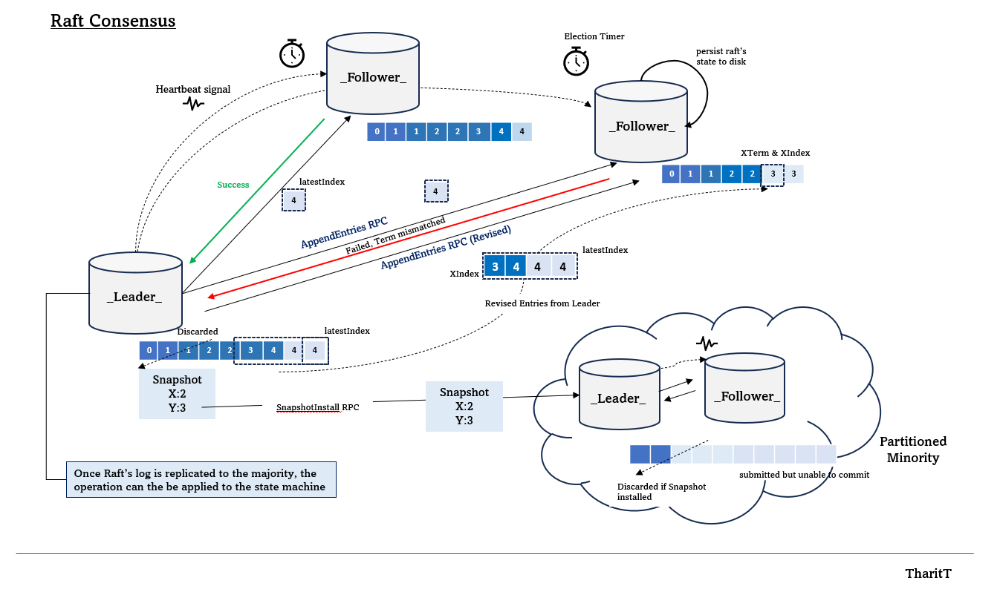
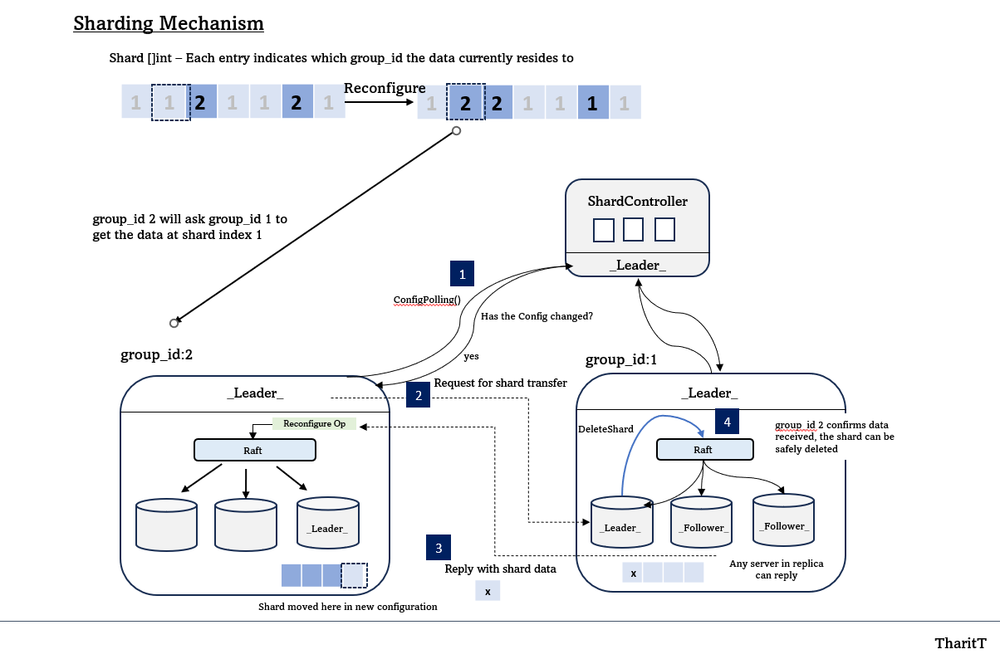

# Distributed Key-Value Store with Raft Consensus

This repository implements a fault-tolerant **Distributed Key-Value Store** built on the **Raft**.

It is semester-long project for MIT's 6.824 Distributed Systems course.
To comply with MIT's Policy (and its generosity to put the entire course in public), I do not post the source code of the **core** implementation. Only API description is shown.

Rather, I describe the architecture of the system below. If you're interested in the code or talk about it, please send me a message :) 

- [x] **Lab #1: MapReduce**
- [x] **Lab #2: KV Server**
- [x] **Lab #3A: Raft Leader Election**
- [x] **Lab #3B: Raft Log**
- [x] **Lab #3C: Raft Persistence**
- [x] **Lab #3D: Raft Log Compaction**
- [x] **Lab #4A: Fault-Tolerant KV Service w/o Snapshots**
- [x] **Lab #4B: Fault-Tolerant KV Service w Snapshots**
- [x] **Lab #5A: Sharded KV: Controller and Static Sharding**
- [x] **Lab #5B: Sharded KV: Shard Movement**
- [x] **Lab #5B: Extra: Garbage Collection of state**

## Features

### Raft Consensus Algorithm

- **Leader Election**: Automatically elects a leader via randomized timeouts and term to promote a node to candidacy, simplifying the election process and avoiding conflicts.
- **Log Replication**: Ensure log replication and its consistency by maintaining the invariant: If two logs share the same index and term, all preceding entries must be identical.
  Leaders continuously send logs to followers until a matching entry is found
- **Persistance**: Periodic capture of operating state for crash recovery. Critical states like currentTerm, votedFor, and logs are periodically persisted to disk.
- **Snapshotting**: Periodic snapshot to optimize memory usage and handle prolog network partitied. The leader sends a snapshot to the follower to bring it up-to-date.

<p align="center">

</p>

### Key-Value Store

- **Get, Put, Append Operations**: Provides external consistency (linearizable history)
- **Atomic Transactions**: Ensures atomicity for updates through Raft's state machine replication. After operation log is replicated in Raft's majority, the operation is sent back to the state machine via internal Go's channel.

### Shard Controller & Movement

**Key strategy**: When the configuration changes, the leader solicits other servers in the replica group who own the shard it needs (under the new configuration). This is easier to reason than every group’s voluntarily sending shards.

- **Shard Movement** Each replica group periodically asks the shard controller if there is a configuration update. If so, The group's leader issues RPC to the any member of the targeted group - not necessarily leader, and ask for the shard data. The data goes through the Raft before being applied to the state machine.
- **Shard Deletion** Once the shard is sent and confirmed by the other group's leader, now the data can be safely deleted and the RPC is issued to the group previously own the data.

<p align="center">

</p>

### Repository Structure

```plaintext
├── src/
│   ├── raft/               # Raft consensus module
│   │   ├── raft.go         # (Hidden - only API shown)
│   │   ├── persister.go    # Persistence interface
│   │   ├── config.go       # Testing
│   │   ├── test_test.go    # Testing
│   ├── shardkv/            # Sharded KV Store module
│   │   ├── client.go       #
│   │   ├── server.go       # (Hidden - only API shown)
│   │   ├── common.go       # RPC args, reply
│   │   ├── config.go       #
│   │   ├── test_test.go    #
│   ├── shardctrler/        # Shard Controller module
│   │   ├── client.go       #
│   │   ├── server.go       # (Hidden - only API shown)
│   │   ├── common.go       #
│   │   ├── config.go       #
│   │   ├── test_test.go    #
│   ├── labrpc/             # Custom RPC call
│   │   ├── labrpc.go       #
│   │   ├── test_test.go    #
│   ├── labgob/             # Custom GOB
│   │   ├── labgob.go       #
│   │   ├── test_test.go    #
│   ├── mr/                 # MapReduce
│   │   ├── coordinator.go  #
│   │   ├── rpc.go          #
│   │   ├── worker.go       #
└── README.md               # Project documentation (this file)
```

### Test Coverage

- **TBC**

## Key Learnings and Challenges

- **TBC**

## References

- [MIT 6.824 Course](https://pdos.csail.mit.edu/6.824/)
